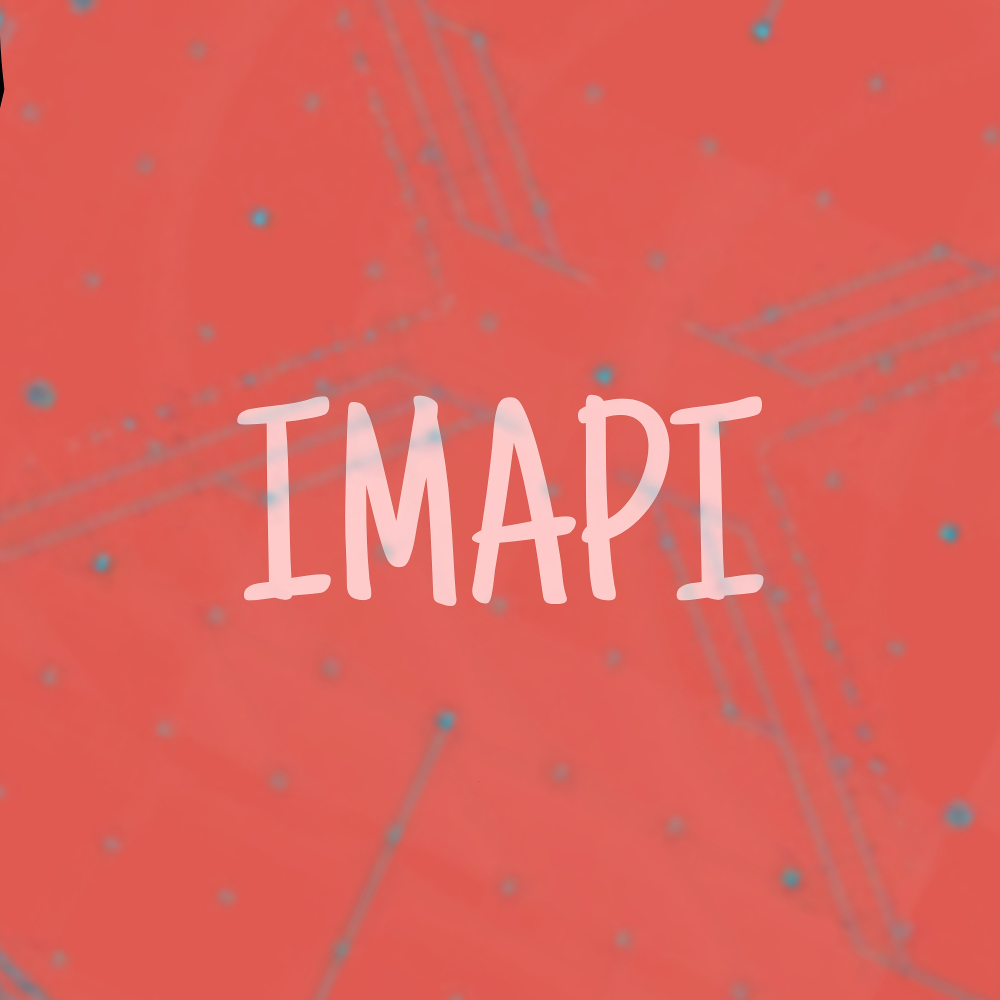

**This is a simple Python Flask API that searches for images on Unsplash and returns a random image link 🖼️**

To use the API, simply send a GET request to `/api/search` with the following query parameter:

```
q=YOUR_SEARCH_TERM
```

For example, to search for images of cats, you would send the following request:

```
GET /api/search?q=cats
```

The API will return a JSON response containing the following key:

```
image_link: The URL of a random image matching the search term. 🖼️
```

Here is an example of a JSON response:

```json
{
  "image_link": "https://images.unsplash.com/photo-1656284342899-718392126c49?ixlib=rb-1.2.1&ixid=MnwxMjA3fDB8MHxwaG90by1wYWdlfHx8fGVufDB8fHx8&auto=format&fit=crop&w=500&q=60"
}
```

You can use the image link in your application to display the image.

#### Running the API

To run the API, simply clone this repository and install the dependencies:

```
pip install -r requirements.txt
```

Then, start the API with the following command:

```
python main.py
```

The API will be running on port 5000 by default. You can access the API at 127.0.0.1:5000/api/search.

**or you can use the getimage.py functions to get img links by args. 🪄**

This project is open source and under the MIT license. 开源 👐

Fork and contribute! 🤝
